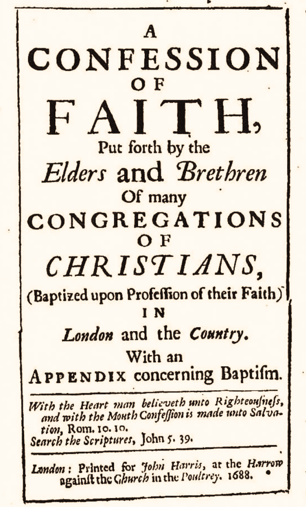

# Theologicus
Still no pen, no words, no image  
can express to you the loveliness  
of my only, only Lord Jesus.  
\- Samuel Rutherford

## upcoming

- [1689 Second London Baptist Confession](https://theologic.us/confession-1689/index.md)

## releases

- v0.1 (2024 Apr 10) Ported 1689 over to submodules

## running

## using

## built on

## contact me

